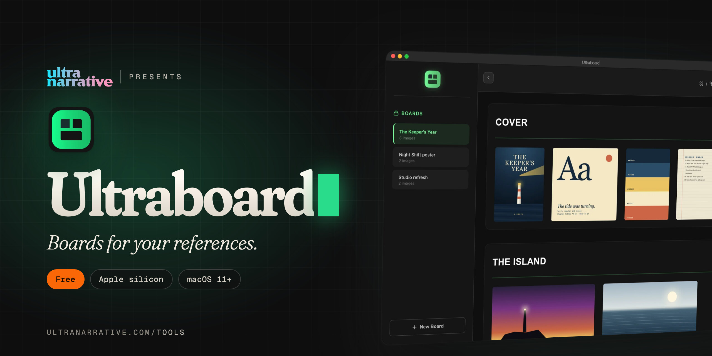

  

# Ultraboard

**Boards for your references.**

*Dan Rodriguez · [UltraNarrative](https://www.ultranarrative.com) · [ultranarrative.com/tools](https://www.ultranarrative.com/tools) · [dan@ultranarrative.com](mailto:dan@ultranarrative.com) · October 2026*

---

Collect images on boards, in a tidy grid or freeform. Sections, layers and comments for moodboards, references and visual research.

Free, for a Mac with Apple silicon, macOS 11 or later. This repository holds the installer only. More free apps at [ultranarrative.com/tools](https://www.ultranarrative.com/tools).

## Download

[Ultraboard-mac-arm64.dmg](https://github.com/ultranarrative/ultraboard-releases/releases/latest/download/Ultraboard-mac-arm64.dmg)

This link always points to the newest version.

## Opening it the first time

I sign Ultraboard myself rather than through Apple, so macOS asks once. Open the disk image, drag Ultraboard to Applications and open it. When macOS stops it, go to System Settings, then Privacy & Security, and click Open Anyway.

## Support

Ultraboard is free, with no account and no subscription. If it helps you, [buy me a coffee](https://ko-fi.com/danrsuarez).

Made by Dan Rodriguez at [UltraNarrative](https://ultranarrative.com). © 2026 UltraNarrative. All rights reserved.
